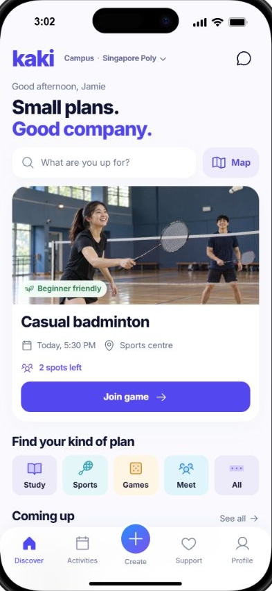
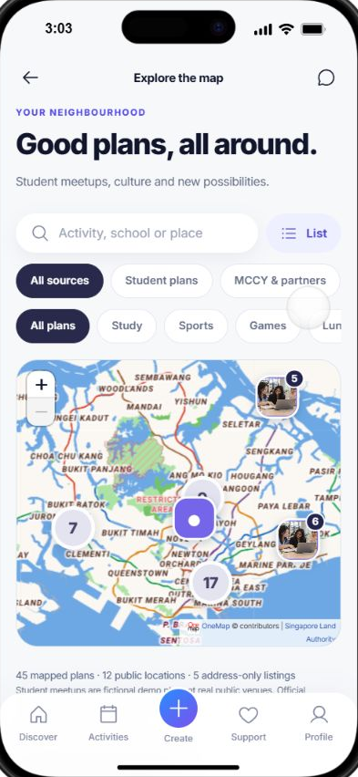
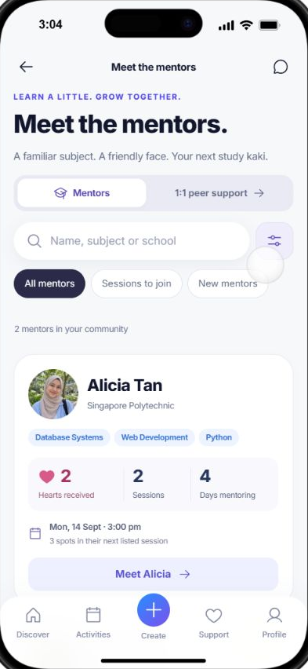
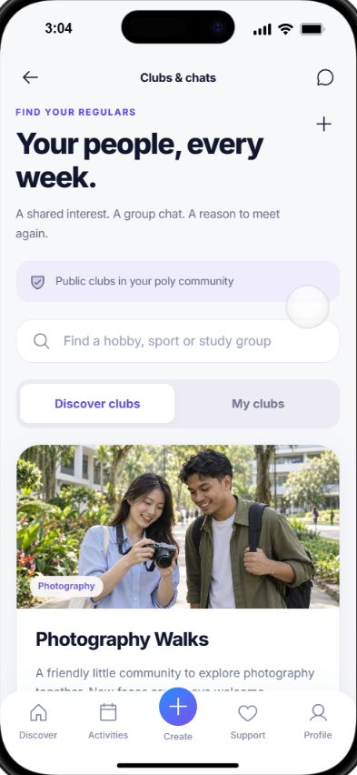
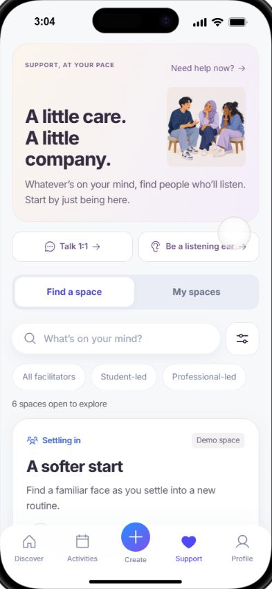
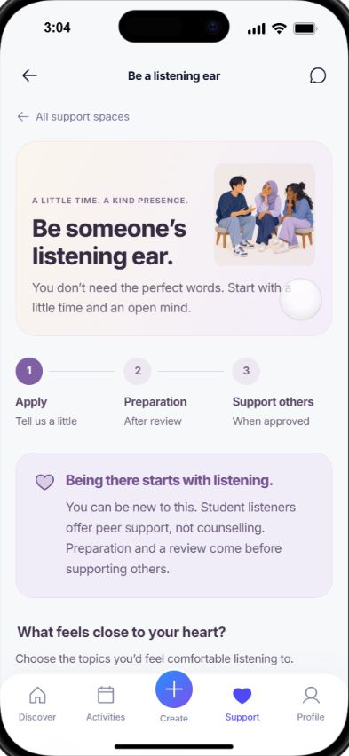

# kaki

**Find your people. Make a small plan.**

kaki is a mobile-first web app that helps students in Singapore meet through shared activities, study together, and find peer support. Designed with polytechnic students as the initial audience, it brings campus plans, neighbourhood meetups, mentors, clubs and support spaces into one place.

This repository contains a working local demo with a React frontend, a Node.js API and persistent SQLite storage. It includes an interactive iPhone/Pixel preview and a responsive desktop view.

## A look inside

Screenshots of the running mobile interface, using fictional demo profiles and activities.

<table>
  <tr>
    <td align="center"><strong>Discover</strong><br></td>
    <td align="center"><strong>Event map</strong><br></td>
    <td align="center"><strong>Mentors</strong><br></td>
  </tr>
  <tr>
    <td align="center"><strong>Clubs</strong><br></td>
    <td align="center"><strong>Support</strong><br></td>
    <td align="center"><strong>A listening ear</strong><br></td>
  </tr>
</table>

## What you can do

- **Find a plan:** browse Study, Sports, Games, Lunch, Interests and Events; search, save, join or host an activity. Dates, capacity and your participation status stay connected to the API.
- **Explore your neighbourhood:** switch from your campus to eligible, host-opted-in plans from other schools. Use the map and activity location pages to see public meeting venues.
- **Study as a peer or mentor:** choose a role when joining a study session. Public mentor profiles show hearts, session counts, days since first mentorship and a **New** tag. Appreciation uses hearts, with no star ratings.
- **Build a club:** join community-visible clubs, discuss plans and organise weekly events. Members can privately contribute postal codes to suggest a convenient public meeting spot.
- **Find support:** explore small groups, larger groups and one-to-one requests, with student-led and illustrative professional-led options. Full groups support waitlists; students can apply to become a listening ear.
- **Keep track:** revisit joined and hosted activities, manage your profile and privacy preferences, and use connections, messages and private reflections.

Education communities cover Secondary, JC/MI, Polytechnic and University. The API applies community and age-band access rules. “Public” clubs and mentor profiles are visible to eligible community members; support participation and listening-ear applications remain private.

## Run locally

Requires **Node.js 24** and npm. Node's built-in SQLite module powers the database.

```sh
git clone https://github.com/chonghaoooi/kaki.git
cd kaki
npm ci
npm run dev
```

Open [the mobile preview](http://127.0.0.1:4173/) and choose **Try demo** to explore the Polytechnic community as Jamie. The [desktop view](http://127.0.0.1:4173/desktop.html) uses the same API and database.

The default demo runs on loopback only and needs no API keys. The server creates `data/kaki.sqlite` automatically; joins, saves, messages and other changes persist across refreshes and restarts. Local databases, environment files, dependencies and generated builds are excluded from Git.

### Demo data

The base seed contains fictional student profiles and activities across all four education communities. An additive catalogue migration supplies **216 more plans**: 36 campus plans and 18 shared neighbourhood plans per education network, balanced across all six activity categories. It inserts stable IDs once and stores its Singapore-date anchor on first migration, so restarts preserve existing records and do not move event dates or reset participation.

Neighbourhood discovery also includes eight curated official source listings linked to MCCY-related venues and NYC. These are separate from fictional kaki plans, retain organiser attribution and send registration to the original provider. They are **curated links, not a live event feed or an organisational partnership**. See [event sources](partner-event-sources.md) for provenance and eligibility notes.

### Run a compiled build

```sh
npm run build
npm start
```

The build type-checks the frontend, generates its static assets and prepares Brotli/gzip compression. The Node server serves both the compiled app and API.

## Checks

```sh
npm run check:runtime
npm test
npm run build
```

`check:runtime` verifies the protected mobile preview runtime. The automated suite covers API access rules, persistence, activity capacity, support privacy, catalogue migrations, discovery filtering and server behaviour. Additional preview interaction checks are available through `npm run test:runtime`.

## Project structure

| Path | Purpose |
| --- | --- |
| `src/` | React 19 and TypeScript app screens, shared components and styles |
| `src/mobile/` | Device frames, safe areas, scrolling and simulated keyboard runtime |
| `server/` | Node.js HTTP API, SQLite storage, demo migrations and tests |
| `public/` | App images, fonts and device assets |
| `tests/` | Discovery logic, mobile runtime and static-serving checks |
| `scripts/` | Runtime verification, build preparation and asset compression |
| `docs/screenshots/` | Mobile screenshots used in this README |

The frontend uses Vite, React, TypeScript, Motion and Phosphor icons. Maps use Leaflet with OneMap tiles. The backend uses Node's built-in HTTP, SQLite and cryptography modules. API credentials stay on the server.

## Demo boundaries

kaki currently demonstrates product flows; it is not an operating student support service. Students, mentors and support facilitators in the seed are fictional. Professional demo facilitators are **unverified**, listening-ear applications remain pending, and one-to-one requests do not confirm a real appointment. Peer support is not counselling.

Live mode is separate from the demo database. Real use still needs authoritative enrolment and age verification, facilitator review, staffed moderation and operational services. Email delivery requires server configuration; Telegram delivery, payments and push notifications are not connected. Map tiles require internet access, and arbitrary postal-code lookup requires a server-side OneMap token. Meeting suggestions use approximate straight-line distances, not journey times or venue reservations.

See [.env.example](.env.example) and the [API and deployment documentation](server/README.md) for configuration, privacy rules and integration boundaries. The runner reads the Node process environment; it does not automatically load `.env` files.

## More documentation

- [API, authentication, privacy and deployment](server/README.md)
- [Demo seed and reproducibility](server/demo-seed.md)
- [Map locations and geographic sources](geography-sources.md)
- [MCCY and NYC listing sources](partner-event-sources.md)
