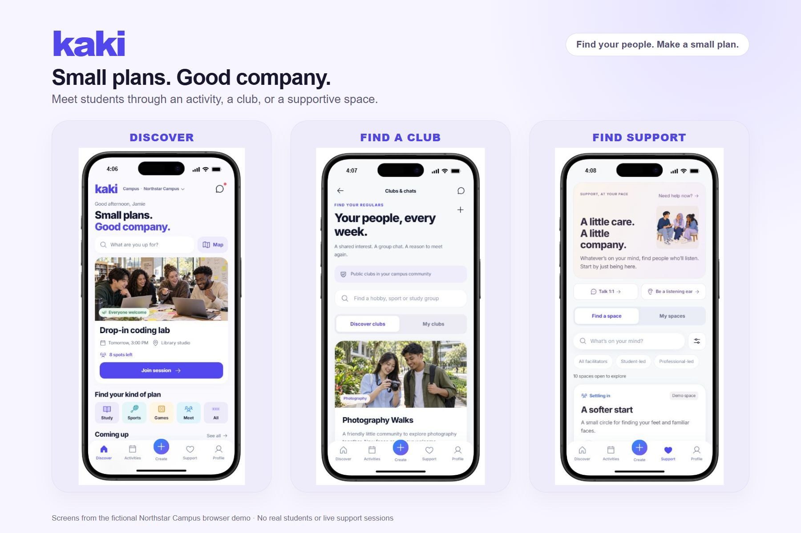
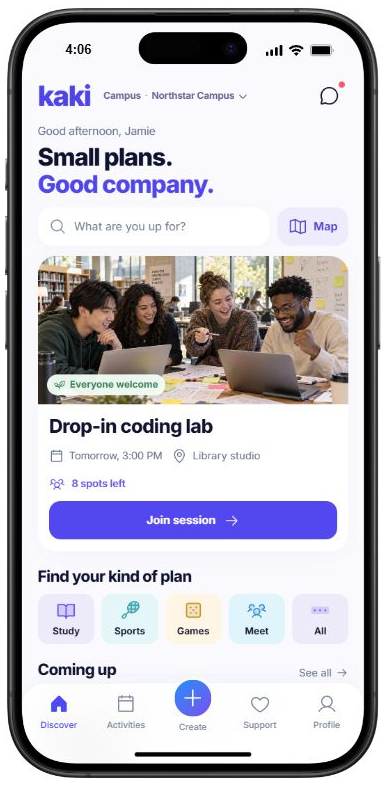
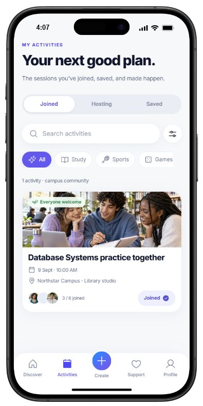
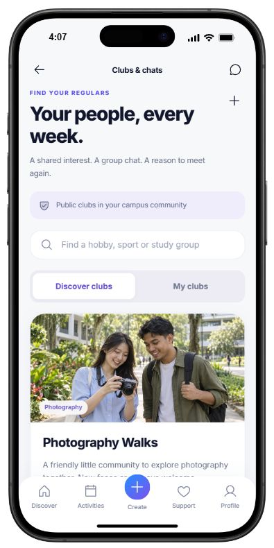
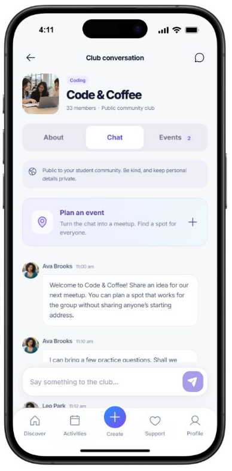
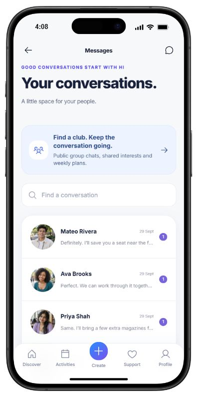
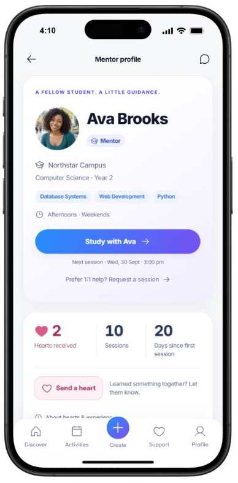
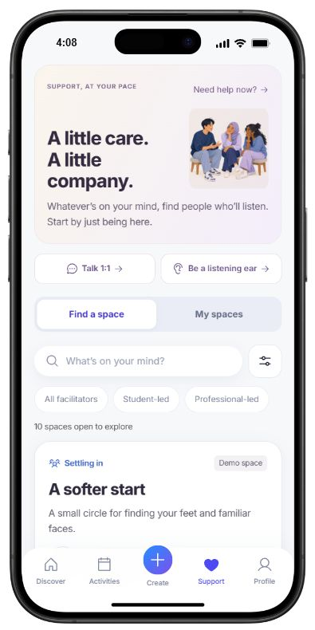
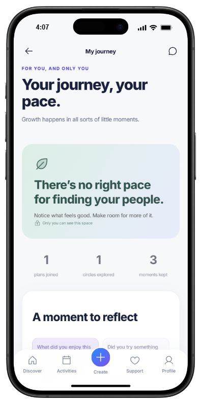
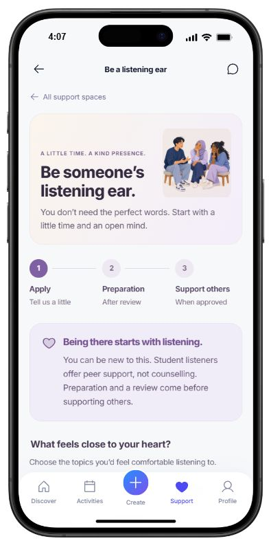

# kaki

**Find your people. Make a small plan.**

kaki is a mobile-first student community app for turning "I want to meet people" into a small plan you can actually join. Students can find a study table, game night, lunch group, creative session or support space; meet a peer or mentor; and keep the connection going through clubs and messages. It is designed especially for students who are new to campus, arriving alone, or looking for a low-pressure way to belong.

[Try the live browser demo](https://kaki-orcin.vercel.app/). It opens directly into **Northstar Campus**, an imaginary campus populated with fictional students, mentors, plans, and conversations. Joins, saves, and sample DM replies stay in your browser. Its map pins are illustrative and provide no real directions. The local developer version also includes a Node.js API and persistent SQLite database; its seeded institutions and venue integrations are an earlier regional prototype, not a worldwide directory.

The app includes an interactive iPhone/Pixel preview and a responsive desktop view.

## The problem and the idea

Finding people at school is often harder than finding an event. Opportunities are scattered across feeds and chats, and a large event can be an awkward first step when you do not know anyone. kaki starts with a shared activity that is small, specific and easy to say yes to. One plan can lead to a conversation, a recurring club, mentorship or a support space.

**Who it is for:** students building a new circle at school, especially newcomers and students who prefer an activity as the starting point for connection. Peers can host plans; students can help in study sessions or apply to be a listening ear. Campus and age-community boundaries keep discovery relevant to eligible students.

## What makes kaki different

- **Connection begins with a plan.** Instead of asking students to make a profile and start a cold conversation, kaki gives them a concrete reason to meet: a small activity with a time, place, capacity and host.
- **The relationship can continue.** A joined activity can become a club conversation, a recurring meetup or a private message. This connects discovery, coordination and repeat participation in one flow.
- **Mentorship is reciprocal and visible.** Students can join a study session as a peer or mentor. Public profiles show days mentoring, completed sessions and hearts from eligible past peers, without star ratings or invented credentials.
- **Groups can choose a fair meeting place.** Club members privately contribute starting postal codes; the group sees suggested public venues rather than each person's exact starting point.
- **Belonging includes support.** Student-led groups, illustrative facilitated groups, one-to-one requests and a listening-ear pathway sit alongside ordinary activities. Support participation stays private, and peer listening is clearly distinguished from professional care.

These are product design choices demonstrated in a prototype, not evidence of measured social or wellbeing outcomes.

## A look inside

These are current, tightly cropped captures of the [live Northstar Campus demo](https://kaki-orcin.vercel.app/) on 29 September 2026. The campus, people, conversations and support spaces are fictional.



<table>
  <tr>
    <td align="center"><strong>Discover</strong><br></td>
    <td align="center"><strong>Activities</strong><br></td>
    <td align="center"><strong>Clubs</strong><br></td>
  </tr>
  <tr>
    <td align="center"><strong>Club chat</strong><br></td>
    <td align="center"><strong>Messages</strong><br></td>
    <td align="center"><strong>Mentor profile</strong><br></td>
  </tr>
  <tr>
    <td align="center"><strong>Support</strong><br></td>
    <td align="center"><strong>Journey</strong><br></td>
    <td align="center"><strong>Listening ear</strong><br></td>
  </tr>
</table>

The [connection](docs/screenshots/devpost-connect.jpg) and [growth](docs/screenshots/devpost-grow.jpg) gallery images are sized for Devpost's 3:2 media display.

## What you can do

- **Find a plan:** browse Study, Sports, Games, Lunch, Interests and Events; search, save, join or host an activity. Dates, capacity and your participation status stay connected to the API.
- **Explore your neighbourhood:** switch from your campus to eligible, host-opted-in plans from other schools. Use the map and activity location pages to see public meeting venues.
- **Study as a peer or mentor:** choose a role when joining a study session. Public mentor profiles show hearts, session counts, days since first mentorship and a **New** tag. Appreciation uses hearts, with no star ratings.
- **Build a club:** join community-visible clubs, discuss plans and organise weekly events. Members can privately contribute postal codes to suggest a convenient public meeting spot.
- **Find support:** explore small groups, larger groups and one-to-one requests, with student-led and illustrative professional-led options. Full groups support waitlists; students can apply to become a listening ear.
- **Keep track:** revisit joined and hosted activities, manage your profile and privacy preferences, and use connections, messages and private reflections.

The local API applies school-community and age-band access rules. “Public” clubs and mentor profiles are visible to eligible community members; support participation and listening-ear applications remain private.

## Run locally

Requires **Node.js 24** and npm. Node's built-in SQLite module powers the database.

```sh
git clone https://github.com/chonghaoooi/kaki.git
cd kaki
npm ci
npm run dev
```

Open [the mobile preview](http://127.0.0.1:4173/) and choose **Try demo** to explore a seeded student community as Jamie. The [desktop view](http://127.0.0.1:4173/desktop.html) uses the same API and database.

The default demo runs on loopback only and needs no API keys. The server creates `data/kaki.sqlite` automatically; joins, saves, messages and other changes persist across refreshes and restarts. Local databases, environment files, dependencies and generated builds are excluded from Git.

### Demo data

The base seed contains fictional student profiles and activities across four education communities. An additive catalogue migration supplies **216 more plans**: 36 campus plans and 18 shared neighbourhood plans per education network, balanced across all six activity categories. It inserts stable IDs once and stores a date anchor on first migration, so restarts preserve existing records and do not move event dates or reset participation.

The earlier local prototype also has curated third-party event links. They are separate from fictional kaki plans, retain organiser attribution and send registration to the original provider. They are **curated links, not a live event feed or an organisational partnership**. See [event sources](partner-event-sources.md) for provenance and eligibility notes.

### Run a compiled build

```sh
npm run build
npm start
```

The build type-checks the frontend, generates its static assets and prepares Brotli/gzip compression. The Node server serves both the compiled app and API.

### Browser-only Vercel demo

The public [Vercel demo](https://kaki-orcin.vercel.app/) uses a bundled browser worker and WebAssembly database so visitors can try interactions without a server or real accounts. A Vercel-only fixture layer renames the setting to imaginary Northstar Campus and adds 15 upcoming activities, 6 populated DM threads, 12 upcoming support spaces, richer club conversations, 3 sample private reflections, varied student portraits and activity/mentor photos. Support spaces cover small and large groups, one-to-one requests, student and illustrative professional facilitators, and full/waitlist states; demo joins and group messages work in the visitor's browser. These records illustrate a used product; they are **not real users, adoption, attendance, or live services**. To reproduce its static deployment files after a build, run `node scripts/prepare-vercel-demo.mjs`; the output is `dist/vercel-demo`. Demo changes stay in the visitor's browser and can be reset there. The browser worker and WebAssembly files are built from this project's demo implementation; generated student photos are fictional OpenAI ImageGen assets. The worker bundle is included so static hosting retains the same demo behaviour.

## Checks

```sh
npm run check:runtime
npm test
npm run build
```

`check:runtime` verifies the protected mobile preview runtime. The automated suite covers API access rules, persistence, activity capacity, support privacy, catalogue migrations, discovery filtering and server behaviour. Additional preview interaction checks are available through `npm run test:runtime`.

## Project structure

| Path | Purpose |
| --- | --- |
| `src/` | React 19 and TypeScript app screens, shared components and styles |
| `src/mobile/` | Device frames, safe areas, scrolling and simulated keyboard runtime |
| `server/` | Node.js HTTP API, SQLite storage, demo migrations and tests |
| `public/` | App images, fonts and device assets |
| `tests/` | Discovery logic, mobile runtime and static-serving checks |
| `scripts/` | Runtime verification, build preparation and asset compression |
| `docs/screenshots/` | Mobile screenshots used in this README |

The frontend uses Vite, React, TypeScript, Motion and Phosphor icons. Maps use Leaflet and a regional tile provider in the local prototype. The backend uses Node's built-in HTTP, SQLite and cryptography modules. API credentials stay on the server.

## Demo boundaries

kaki currently demonstrates product flows; it is not an operating student support service. Students, mentors and support facilitators in the seed are fictional. Professional demo facilitators are **unverified**, listening-ear applications remain pending, and one-to-one requests do not confirm a real appointment. Peer support is not counselling.

Live mode is separate from the demo database. Real use still needs authoritative enrolment and age verification, facilitator review, staffed moderation and operational services. Email delivery requires server configuration; Telegram delivery, payments and push notifications are not connected. Map tiles require internet access, and arbitrary postal-code lookup in the local prototype requires a configured map-provider token. Meeting suggestions use approximate straight-line distances, not journey times or venue reservations.

See [.env.example](.env.example) and the [API and deployment documentation](server/README.md) for configuration, privacy rules and integration boundaries. The runner reads the Node process environment; it does not automatically load `.env` files.

## More documentation

- [API, authentication, privacy and deployment](server/README.md)
- [Demo seed and reproducibility](server/demo-seed.md)
- [Map locations and geographic sources](geography-sources.md)
- [Third-party listing sources](partner-event-sources.md)
